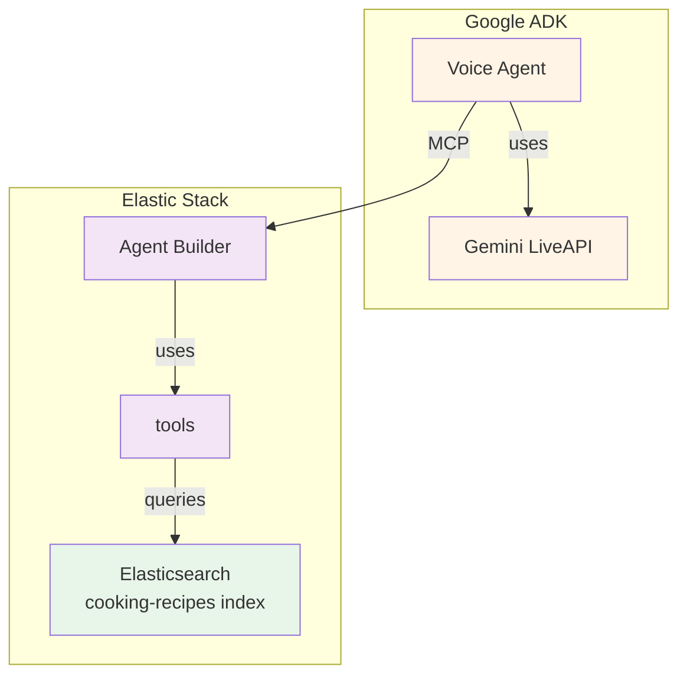

```mermaid
graph TB
    subgraph Google["Google ADK"]
        VA[Voice Agent]
        Live[Gemini LiveAPI]
    end

    subgraph Elastic["Elastic Stack"]
        AB[Agent Builder]
        Tool[tools]
        ES[Elasticsearch<br/>cooking-recipes index]
    end

    VA -->|uses| Live
    VA -->|MCP| AB
    AB -->|uses| Tool
    Tool -->|queries| ES

    style VA fill:#fff4e6
    style Live fill:#fff4e6
    style AB fill:#f3e5f5
    style Tool fill:#f3e5f5
    style ES fill:#e8f5e9
```
